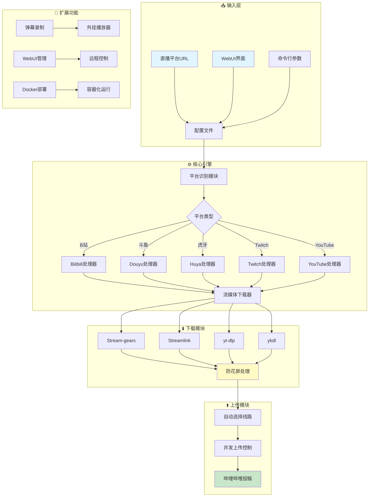
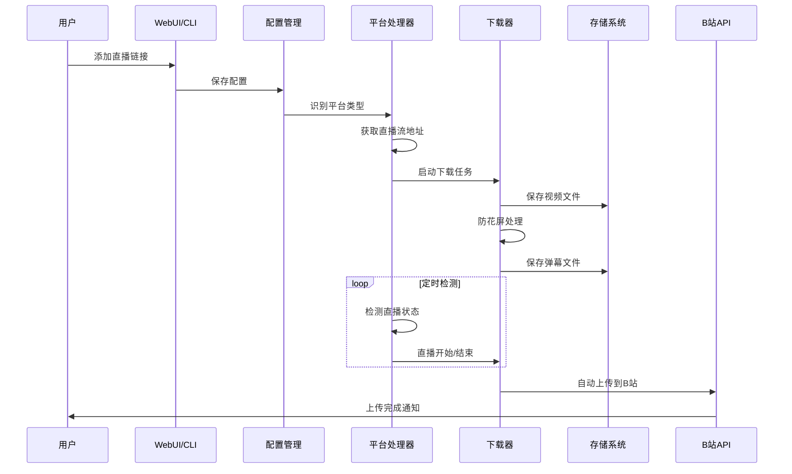

<p align="center">
    
</p>

# 🎬 fork-biliup - B站直播录制与上传工具


## 📖 项目简介

fork-biliup是B站直播录制与自动上传工具,支持多平台直播录制(B站、斗鱼、虎牙、Twitch、YouTube等),自动选择上传线路,支持弹幕录制和WebUI管理。

## 📦 项目来源

- **原项目**: [biliup/biliup](https://github.com/biliup/biliup)
- **原作者**: ForgQi
- **开源协议**: MIT License
- **Fork时间**: 2024年

## 🔧 二次开发内容

本项目为原项目的学习研究版本,未进行实质性修改,主要用于:
- 学习直播流媒体的录制原理
- 研究多平台直播源的解析方法
- 了解自动上传技术的实现

## 系统架构 | System Architecture



## 数据流转流程 | Data Flow



<div align="center">

[](http://www.python.org/download)
[](https://pypi.org/project/biliup)
[](https://pypi.org/project/biliup)
[](https://github.com/biliup/biliup/blob/master/LICENSE)
[](https://t.me/+IkpIABHqy6U0ZTQ5)


[](https://github.com/biliup/biliup/issues)
[](https://github.com/biliup/biliup/stargazers)
[](https://github.com/biliup/biliup/network)

</div>


  <p align="center">
    录制各大主流直播平台并上传至哔哩哔哩弹幕网<br />
  自动选择上传线路，保证上传稳定性，可手动调整并发<br />
    支持录制哔哩哔哩、斗鱼、虎牙、Twitch直播弹幕用于外挂播放器<br />
 防止录制花屏（使用默认的stream-gears下载器就会有这个功能），解决网络、PK导致的花屏。


<br />
    <a href="https://biliup.github.io/biliup/docs/guide/changelog"><strong>更新日志 »</strong></a>
    <br />
    <br />
    <a href="https://github.com/biliup/biliup/wiki/%E5%AE%89%E8%A3%85-%E8%BF%90%E8%A1%8C-%E6%9B%B4%E6%96%B0-%E5%8D%B8%E8%BD%BD">简易教程</a>
    ·
    <a href="https://biliup.me/">交流社区</a>
    ·
    <a href="https://github.com/biliup/biliup-app">投稿工具</a>
  </p>
</div>


<p align="center">
  <b>社区教程</b>: <a href="https://www.bilibili.com/opus/908292536945082370">图文教程</a> by <a href="https://github.com/ikun1993">@ikun1993</a>编写。
</p>


## Quick Start
### Windows
下载 exe: [Release](https://github.com/biliup/biliup/releases/latest)

### Linux or macOS
0. python`version >= 3.8`
1. `pip3 install biliup`
2. `biliup start`
3. 启动时访问 `http://your-ip:19159` 使用webUI，

### Docker
```sh
docker run -d \
  --name biliup \
  --restart unless-stopped \
  -p 0.0.0.0:19159:19159 \
  -v /path/to/save_folder:/opt \
  ghcr.io/biliup/caution:latest \
  --password password123
```
#### docker-compose.yml [点我](https://github.com/biliup/biliup/blob/master/docker-compose.yml) 
* 用户名为`biliup`
* 暴露在公网中也许会产生风险，所以设置密码是很有必要的。
* 以上示例根据需求进行修改，只作为参考。

* * * * * * * * *


## How to Contribute

1. nodejs `version >= 18`
2. `npm i`
3. `npm run dev`
4. `python3 -m biliup`
5. 访问`http://localhost:3000`

## 支持

| 直播平台 | 支持类型      | 链接示例 | 特殊注释 |
| :------:| :--------------: | --------- | ------ |
| 虎牙 | 直播 | `https://www.huya.com/123456` | 可录制弹幕 |
| 斗鱼 | 直播 | `https://www.douyu.com/123456` | 可录制弹幕 |
| YY语音 | 直播 | `https://www.yy.com/123456` |
| 哔哩哔哩 | 直播 | `https://live.bilibili.com/123456` | 特殊分区hls流需要单独配置/可录制弹幕 |
| acfun | 直播 | `https://live.acfun.cn/live/123456` |
| afreecaTV | 直播 | `https://play.afreecatv.com/biliup123/123456` | 录制部分直播时需要登陆 |
| bigo | 直播 | `https://www.bigo.tv/123456` |
| 抖音 | 直播 | 直播:`https://live.douyin.com/123456(直播间数字号)`<br>直播:`https://live.douyin.com/tiktok(抖音号)`<br>主页:`https://www.douyin.com/user/456789(抖音号)` | 使用主页链接或被风控需配置cookies |
| 快手 | 直播 | `https://live.kuaishou.com/u/biliup123` | 监控开播需使用中国大陆IPv4家宽，<br>且24小时内单直播间最多120次请求 |
| 网易CC | 直播 | `https://cc.163.com/123456` |
| flextv | 直播 | `https://www.flextv.co.kr/channels/123456/live` |
| 映客 | 直播 | `https://www.inke.cn/liveroom/index.html?uid=123456` |
| 猫耳FM | 直播 | `https://fm.missevan.com/live/123456` | 猫耳为纯音频流 |
| nico | 直播 | `https://live.nicovideo.jp/watch/lv123456` | 可配置登录信息 |
| twitch | 直播<br>回放 | 直播:`https://www.twitch.tv/biliup123`<br>回放:`https://www.twitch.tv/biliup123/videos?filter=archives&sort=time`  | 可配置登录信息/尽量录制回放/可录制弹幕 |
| youtube | 直播<br>回放 | 直播:`https://www.youtube.com/watch?v=biliup123(单场)`<br>直播:`https://www.youtube.com/@biliup123/live(最远的预约)`<br>回放:`https://www.youtube.com/@biliup123/videos` | 可配置登录信息/尽量录制回放/可配置回放下载日期 |
* 理论上streamlink与yt-dlp支持的都可以下载，但不保证可以正常使用，详见:[streamlink支持列表](https://streamlink.github.io/plugins.html)，[yt-dlp支持列表](https://github.com/yt-dlp/yt-dlp/tree/master/yt_dlp/extractor).


## Credits
* Thanks `ykdl, youtube-dl, streamlink` provides downloader.
* Thanks `THMonster/danmaku`.


## 捐赠
* 爱发电 :`https://afdian.net/a/biliup`


## Stars
[](https://star-history.com/#biliup/biliup&Date)
